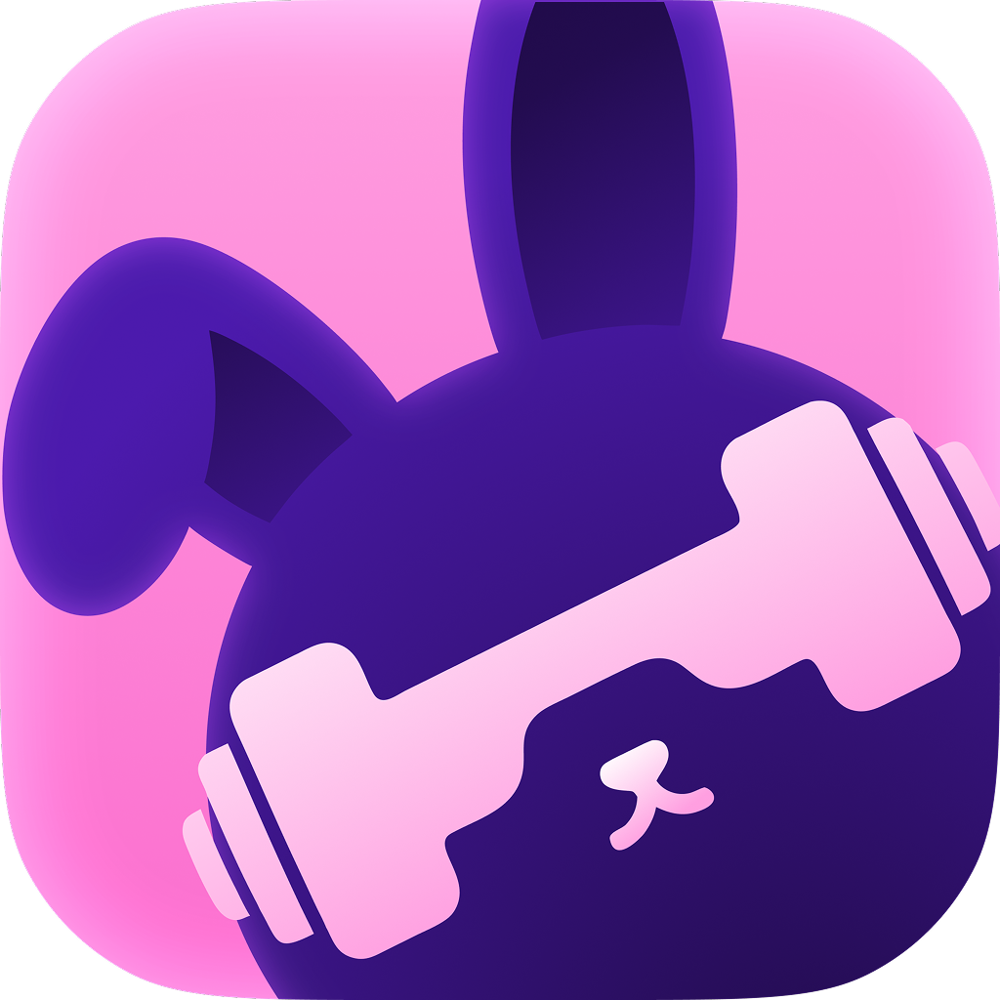

# Gym Bunny

Нативное iOS-приложение для создания, планирования и выполнения тренировок, отслеживания результатов и поддержания мотивации.

Приложение разработано мной самостоятельно — от исследования пользовательских сценариев и проектирования интерфейса до реализации, тестирования и подготовки к релизу.

> Статус проекта: закрытое тестирование в TestFlight

## О приложении

Gym Bunny помогает пользователю составлять индивидуальные тренировки, выполнять упражнения в реальном времени и отслеживать прогресс.

Приложение рассчитано на использование непосредственно во время занятий: основные действия доступны быстро, а большая часть функций работает без подключения к интернету.

## Основные возможности

- Библиотека примерно из 90 упражнений с поиском и фильтрацией
- Создание и редактирование собственных упражнений и тренировок
- Планирование тренировок по дням недели или заданной периодичности
- Поддержка подходов, суперсетов, дропсетов, интервалов, времени и дистанции
- Таймеры тренировки и отдыха
- Сохранение истории результатов
- Статистика по упражнениям и замерам тела
- Графики прогресса
- Челленджи и достижения
- Добавление и воспроизведение видео упражнений
- AI-генерация тренировок по параметрам пользователя
- Офлайн-доступ к основным функциям

## AI-генерация тренировок

Пользователь может сформировать тренировку с учётом:

- цели;
- длительности;
- уровня сложности;
- целевых групп мышц;
- доступного оборудования;
- нежелательных упражнений;
- физических ограничений;
- необходимости добавить кардио или упражнения на пресс.

Перед отправкой запроса приложение фильтрует собственную базу упражнений. OpenRouter возвращает результат в структурированном JSON-формате, после чего тренировка декодируется, отображается для редактирования и может быть сохранена в локальное хранилище.

API-ключ хранится на серверной стороне с использованием Cloudflare Workers и не включается в сборку приложения.

## Технологии

- Swift
- SwiftUI
- UIKit
- SwiftData
- Swift Charts
- async/await
- URLSession
- REST API
- Codable / JSON
- PhotosUI
- AVKit
- OpenRouter API
- Cloudflare Workers
- XCTest
- Git / GitHub
- Figma
- TestFlight

## Архитектура

Приложение построено с разделением ответственности между:

- SwiftUI-представлениями;
- моделями состояния и ViewModel;
- локальным слоем данных на SwiftData;
- сетевым клиентом;
- вспомогательными менеджерами отдельных модулей.

Основные пользовательские данные, тренировки и история результатов хранятся локально. Сетевое соединение требуется только для генерации тренировок.

## Интерфейс

### Главный экран

Быстрый доступ к запланированным тренировкам, активной тренировке, челленджам, достижениям и актуальным замерам.

### Библиотека

Управление упражнениями и тренировками, поиск, фильтрация и добавление пользовательских упражнений.

### Тренировочный процесс

Выполнение упражнений в реальном времени с поддержкой различных типов трекинга и таймеров отдыха.

### Генерация тренировок

Создание тренировки на основе параметров и ограничений пользователя через OpenRouter API.

### Статистика

Отображение истории результатов, динамики упражнений и замеров тела с использованием Swift Charts.

## Моя роль

Проект выполнен самостоятельно в рамках выпускной квалификационной работы и продолжает
